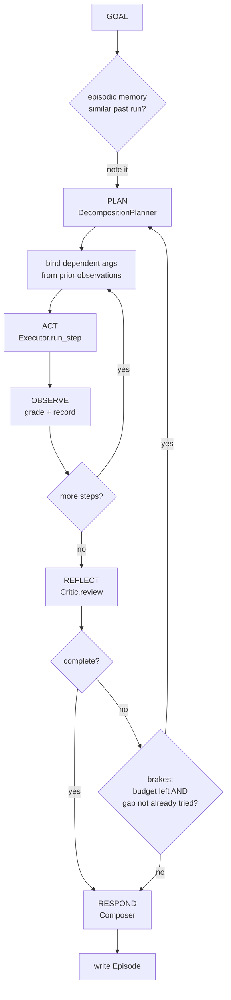

# System Design: Offline Agentic AI Demo

**Version** 1.0 · **Status** implemented · **Runtime** Python 3.10+, standard library only

---

## 1. Purpose and scope

### 1.1 Problem statement

Agentic AI systems are usually taught by wiring together a model API, a vector
database and a framework. That approach hides the thing worth learning. The
model's decisions are opaque, the framework's control flow is buried under
abstraction, and the student cannot tell which behaviour came from the
architecture and which came from the model happening to be good that day.

This system inverts the trade. It implements the full agentic architecture —
planning, routing, tool use, retrieval, observation, failure recovery,
reflection, memory and multi-agent coordination — and replaces every point where
a model would exercise judgement with an explicit, readable rule.

### 1.2 Goals

| # | Goal | How it is met |
|---|------|---------------|
| G1 | Run with zero external dependencies | Standard library only; no network, no API key, no package install |
| G2 | Make the control flow observable | Every stage emits a trace event; the console output *is* the trace |
| G3 | Be deterministic and reproducible | No randomness anywhere; failures injected on a fixed schedule |
| G4 | Demonstrate failure, not just success | Three injectable failure modes with three distinct recovery paths |
| G5 | Be structurally faithful to real systems | Component seams sit where they sit in LLM-backed systems |
| G6 | Be modifiable in one sitting | ~3,300 lines total; each component testable in isolation |

### 1.3 Non-goals

- **Answer quality.** Answers are assembled from templates. Prose generation is
  explicitly out of scope.
- **Retrieval quality.** TF-IDF is a teaching stand-in for embeddings.
- **Throughput, concurrency, persistence at scale.** Single process, sequential
  execution, JSON on disk.
- **Natural language understanding.** The planner is rules. It will mis-parse
  goals that a model would handle, and that is left visible rather than patched.

### 1.4 Design constraint that shapes everything

> Every decision a language model would make must be replaced by a rule that a
> reader can locate, understand and modify — without changing the surrounding
> architecture.

This constraint is why the seams fall where they do. `KeywordRouter.route()`
returns `(tool_name, reason)` because that is exactly what a function-calling
response gives you. `RagSearchTool` returns a `grade` because a relevance
grader in production returns a verdict. The rules are throwaway; the interfaces
are the lesson.

---

## 2. Architecture overview

### 2.1 Layer diagram

```
┌──────────────────────────────────────────────────────────────────────┐
│  PRESENTATION            run_demo.py  ·  lessons.py                  │
│  CLI parsing, narration. No agent logic.                             │
└───────────────────────────────┬──────────────────────────────────────┘
                                │
┌───────────────────────────────▼──────────────────────────────────────┐
│  ORCHESTRATION           agent.py  ·  multi_agent.py                 │
│  Agent.solve() loop · dependency binding · Composer                  │
│  Team / Blackboard / Specialist                                      │
└───┬──────────────────┬──────────────────┬────────────────────────────┘
    │                  │                  │
┌───▼──────────┐  ┌────▼─────────┐  ┌─────▼────────┐
│  REASONING   │  │  EXECUTION   │  │  EVALUATION  │
│  planner.py  │  │  executor.py │  │ reflection.py│
│  goal→steps  │  │ retry·fallbk │  │ checks→gaps  │
└───┬──────────┘  └────┬─────────┘  └─────┬────────┘
    │                  │                  │
┌───▼──────────────────▼──────────────────▼────────────────────────────┐
│  CAPABILITY              tools/  ·  errors.py                        │
│  Tool · ToolResult · ToolRegistry · ToolError taxonomy               │
│  calculator · weather · web_search · rag_search · notepad            │
└───┬──────────────────────────────────────────────────────────────────┘
    │
┌───▼──────────────────────────────────────────────────────────────────┐
│  FOUNDATION       retrieval.py  ·  memory.py  ·  trace.py            │
│  TF-IDF index · Scratchpad/Episodic · Tracer (cross-cutting)         │
└──────────────────────────────────────────────────────────────────────┘
```

`trace.py` is cross-cutting: every layer above Foundation emits into it, and
nothing reads from it except the renderer and the metrics summary.

### 2.2 Dependency rule

Dependencies point strictly downward. `retrieval.py` knows nothing about
agents; `planner.py` knows nothing about execution; `executor.py` knows nothing
about reflection. The single upward-facing exception is deliberate:
`reflection.py` imports `ROUTING_RULES` from `planner.py` to build its
`TASK_TERMS` set, because the critic must know which goal words the router
already consumed (see §7.3).

### 2.3 Control flow



Two independent brakes govern termination (§8). Both are required: the budget
bounds the worst case, the progress check catches the common case of an agent
re-attempting a gap it has already failed.

---

## 3. Data model

The system passes six record types between components. All are frozen-in-spirit
dataclasses; ownership is single-writer.

| Type | Module | Produced by | Consumed by | Purpose |
|------|--------|-------------|-------------|---------|
| `Step` | planner | Planner | Executor, Agent | One unit of work: intent, tool, args, reason, `depends_on` |
| `Plan` | planner | Planner | Agent, Critic | Ordered `Step` list plus a `note` explaining the strategy |
| `ToolResult` | tools | Tool | Executor | `summary`, `data`, `citations`, `grade`, `meta` |
| `Observation` | executor | Executor | Critic, Composer | The unit of evidence — result plus execution history |
| `Reflection` | reflection | Critic | Agent, Composer | `complete`, `score`, `issues`, `gaps`, `confidence` |
| `Event` | trace | everything | renderer, metrics | `seq`, `depth`, `stage`, `label`, `detail`, `duration_ms`, `status` |

### 3.1 `Step` — why `reason` is a field

```python
@dataclass
class Step:
    intent: str            # the sub-goal, in words
    tool: str
    args: dict
    reason: str            # why this tool, for this sub-goal
    depends_on: list[int]
    id: int
```

`reason` is not decoration. It is what makes a plan auditable *before* any tool
runs, and it is what the critic parses to learn which trigger word the router
consumed. A plan that cannot explain itself cannot be reviewed — by a human or
by a critic agent.

### 3.2 `Observation` — the central record

```python
@dataclass
class Observation:
    step: Step
    tool: str                      # may differ from step.tool after fallback
    ok: bool
    summary: str
    data: Any
    citations: list[str]
    grade: str                     # strong | weak | none
    attempts: int                  # >1 proves a retry occurred
    error: dict | None
    recovered_with: str | None     # the fallback tool that succeeded
    alternates_tried: list[str]    # what was attempted and did not help
```

The last four fields exist so that recovery is *provable* rather than inferred.
A run that silently recovered is otherwise indistinguishable from a run that
never had a problem — and the difference matters when the recovery stops
working. `usable` is defined as `ok and grade != "weak"`, which keeps soft
failures out of the evidence pool without discarding them from the record.

`tool` deliberately diverges from `step.tool` after a fallback, so the answer
can attribute evidence to its true source while the step still shows the
original intent.

---

## 4. Component design

### 4.1 Planner (`planner.py`)

Three implementations, presented as an escalation rather than alternatives.

**`NaivePlanner`** — the starting artefact, preserved verbatim with three real
bugs: case sensitivity, substring matching (`"news"` inside `"newsletter"`), and
single-tool output. Two unit tests assert these bugs so they cannot be silently
"fixed"; the lesson depends on them.

**`KeywordRouter`** — `route(query) -> (tool, reason)`. Rules are a
`list[tuple[str, tuple[str, ...]]]`, first match wins, empty trigger tuple marks
the default. Query tokens *and* trigger words are both stemmed, so `Calculate`,
`calculating` and `calculation` reach the same rule. Normalising only one side
is the common half-fix.

**`DecompositionPlanner`** — `plan(goal, gaps=None) -> Plan`. Three paths:

1. **Replan path** (`gaps` supplied) — one step per gap, routed independently.
2. **Comparison path** — two named cities plus a comparison word produces three
   steps: two lookups and one dependent calculation with `depends_on=[1,2]`.
3. **Clause path** — split on `and then`, `;`, `?`, `and also`; route each
   clause; expand a multi-city weather clause into one call per city, because
   the tool's contract takes a single city.

Argument extraction is per-tool: city names matched against the known set with a
capitalised-noun-after-preposition fallback; arithmetic via regex; everything
else passed through as a query string.

### 4.2 Executor (`executor.py`)

Owns all recovery policy. `run_step(step) -> Observation`, never raises.

```
run_step
 ├─ tool in dead_tools? ─────────────────► skip to fallback chain
 ├─ call with retry (max_attempts=3, backoff 0.02s × 2^n)
 │   ├─ success, grade=strong ───────────► return
 │   ├─ success, grade=weak ─────────────► _try_better_source (§6.3)
 │   └─ ToolError
 │        ├─ retryable    ──────────────► retry
 │        ├─ unavailable  ──────────────► mark dead, then fallback
 │        └─ otherwise    ──────────────► fallback immediately
 └─ fallback chain (declared, ordered)
      ├─ translate args for the alternate tool
      ├─ success ────────────────────────► Observation(recovered_with=alt)
      └─ exhausted ──────────────────────► Observation(ok=False, grade="none")
```

Two details that are easy to get wrong and are called out in code comments:

- **Argument translation.** `weather(city="Kano")` must become
  `web_search(query="Kano weather")`. Passing the original kwargs to the
  alternate tool is a classic fallback bug.
- **Dead-tool memoisation.** An `unavailable` failure marks the tool dead for
  the remainder of the run, so later steps do not re-probe a known-down
  dependency.

### 4.3 Critic (`reflection.py`)

`review(goal, plan, observations) -> Reflection`. Five mechanical checks:

| # | Check | Produces |
|---|-------|----------|
| 1 | Every planned step produced an observation | gap = step intent |
| 2 | No step failed outright | gap = step intent; hint → issue |
| 3 | No retrieval graded weak | issue; gap **only if** alternates untried |
| 4 | Evidence mentions the goal's content terms | gap = missing terms |
| 5 | No dependent step ran with unresolved placeholder args | issue only |

```
score = coverage × (usable_observations / total_observations)
complete = (no gaps) and (at least one usable observation)
```

Check 3's conditional is a design rule with teeth: **a gap is a request for
action, so one is only raised if an action remains.** When the executor has
already tried every alternate source, re-planning would just re-run the tool
that failed. The critic records the caveat and stops.

Check 4 excludes `TASK_TERMS` — imperatives plus every router trigger word.
Rationale in §7.3.

### 4.4 Agent (`agent.py`)

The loop is intentionally short; the interesting work is delegated. Its own
responsibilities are exactly two:

**Dependency binding.** Before a step with `depends_on` executes,
`_resolve_dependencies` reads the referenced observations and rewrites the
placeholder argument — `"<from steps 1 and 2>"` becomes `"31 - 28"`. If the
inputs never arrived, the argument is blanked rather than passed as a
placeholder, so the tool raises `invalid_input` and the critic sees it. This is
where most multi-step agents actually break.

**Progress tracking.** Gap strings are normalised (`_norm`: lowercased,
tokenised, sorted) so re-phrasings collide, and accumulated in an `attempted`
set across iterations.

`Composer` renders the answer. Two rules it enforces: cite only what is
actually displayed, and deduplicate evidence across replan iterations. Both
prevent an answer from looking better-sourced than it is.

### 4.5 Multi-agent (`multi_agent.py`)

| Role | Tools | Output |
|------|-------|--------|
| Researcher | `rag_search`, `web_search` | `evidence` entries with citations |
| Analyst | `calculator`, `weather` | `measurement` and `number` entries |
| Critic | *none* | `critique` entry |
| Writer | *none* | `answer` entry |

**Specialisation is enforced by `ToolRegistry.subset()`, not by instruction.**
The researcher cannot do arithmetic because `calculator` is absent from its
registry. Constraining capability is strictly more reliable than asking a
component not to do something — this is the one architectural claim in the
project that transfers unchanged to LLM-backed systems.

Sub-agents run with `max_iterations=1` and their own `EpisodicMemory`; the
coordinator owns the outer loop. Handoffs post rendered passage text with
citations, never the tool's score summary — the failure this guards against is
the writer receiving `"3 passage(s), top score 0.24"` and being forced to
paraphrase a paraphrase.

---

## 5. Tool subsystem

### 5.1 The contract

```python
class Tool:
    name: str
    description: str              # what the planner routes on
    args_schema: dict[str, str]
    def run(self, **kwargs) -> ToolResult   # raises ToolError
    def spec(self) -> dict                  # function-calling JSON
```

`spec()` emits the exact shape an LLM would be shown. This makes a common
production bug visible: when a model "picks the wrong tool", the defect is
usually in this JSON, not in the model.

### 5.2 Registry

`ToolRegistry` provides `register`, `get`, `has`, `names`, `catalog` (human
view), `specs` (model view) and `subset` (capability narrowing). `get()` on an
unknown name raises `ToolError(kind="unavailable")` rather than `KeyError`, so a
planner hallucinating a tool name flows through the same recovery path as a
downed dependency.

### 5.3 Implementations

| Tool | Design note |
|------|-------------|
| `calculator` | AST parse with an operator **allow-list**, never `eval`. Exponent capped at 64. Allow-list the operations, never deny-list the attacks. |
| `weather` | Canned data plus deterministic failure injection (§6.1). Single-city contract, stated in the description, which is what forces the planner to expand multi-city clauses. |
| `web_search` | Same index implementation as `rag_search`; differs only in description (recent, dated, external). Routing between two tools that share an implementation but differ in freshness and authority is common in practice. |
| `rag_search` | Adds relevance grading against a calibrated threshold (0.16). |
| `notepad` | The only tool with a side effect. Kept separate so read-only sub-agents can be handed a registry without it. |

---

## 6. Failure model

### 6.1 Taxonomy

`ToolError(message, kind, hint, tool)` where `kind` determines strategy:

| Kind | Retryable | Strategy | Injected by |
|------|-----------|----------|-------------|
| `transient` | ✅ | Retry with exponential backoff, bounded at 3 | `WeatherTool(fail_first_n_calls=N)` |
| `invalid_input` | ❌ | Repair arguments; identical args fail identically | `calculator("1/0")`, empty city |
| `not_found` | ❌ | Fall back to a broader source | `weather(city="Kano")` |
| `unavailable` | ❌ | Route around; memoise the outage | `WeatherTool(offline=True)` |

Only `transient` is in `RETRYABLE_KINDS`. Everything else short-circuits the
retry loop with a traced `not retryable` event, because retrying an
`invalid_input` with the same arguments is pure budget waste.

### 6.2 Deterministic injection

Failures fire on a fixed call schedule, not randomly. This is a testability
decision: a recovery test that flaps is a test that gets deleted. It also means
Lesson 6 shows the same three traces on every machine, every run.

### 6.3 Weak evidence as a soft failure

A *successful* call returning weakly-relevant evidence is the origin of
confident wrong answers, so it enters the recovery path:

```
grade == "weak"  →  _try_better_source(step, weak_obs)
                     for each declared alternate:
                       result strong?  → return upgraded Observation
                       result weak?    → record in alternates_tried, keep original
```

**The policy only upgrades.** If the alternate is also weak, the original is
retained and the weak grade stays visible to the critic. Swapping weak evidence
for different weak evidence hides the problem rather than fixing it.

A corollary the system demonstrates explicitly: **a successful fallback is not a
satisfied goal.** Asking for the weather in Kano falls back to a weather *news
article* — the call succeeds, the citation is real, and the goal is unmet.
Check 4 in the critic is what catches this class of failure.

---

## 7. Key design decisions

Recorded ADR-style: decision, rationale, alternative rejected.

### 7.1 Recovery policy lives in the Executor, declared up front

`DEFAULT_FALLBACKS` is a module-level `dict[str, list[str]]`.

*Rejected:* per-tool `try/except` improvisation at call sites. Improvised
recovery produces agents that behave differently every run and cannot be tested,
and it scatters policy across the codebase where no one can audit it.

### 7.2 Two independent termination brakes

Iteration budget (`max_iterations=3`) **and** a no-progress check.

*Rejected:* budget alone. The budget bounds the worst case but permits three
identical wasted loops, which is the common failure. *Rejected:* progress check
alone — it cannot catch a pathological plan that generates novel-looking gaps
forever.

### 7.3 Coverage excludes task terms

Check 4 scores only content terms, filtering imperatives (`compare`, `give`,
`explain`) and every router trigger word.

*Rationale:* a weather reading says `"31C, humid"` — it will never contain the
word `compare` or `temperature`. Scoring those as missing reports a failure on a
run that worked perfectly. A trigger word that selected a tool which then
succeeded is already accounted for: the tool running *is* the evidence the term
was handled.

*Consequence, accepted:* a genuinely ignored instruction verb goes unflagged.
The alternative — a critic that cries wolf on every successful run — gets
switched off, which is strictly worse than a slightly permissive one.

### 7.4 Stemming in the retrieval tokenizer

`evaluate` / `evaluation` / `evaluating` collapse to one token.

*Rationale:* discovered during construction. Without it the retriever picked the
wrong document for several obviously-on-topic queries. *Kept as teaching
material* because lexical mismatch is the honest argument for dense embeddings —
they collapse semantic distance, not merely spelling.

*Accepted cost:* over-stemming produces occasional odd collisions, and stems
must never surface in user-visible text (`_missing_terms` reports surface forms).

### 7.5 Templated answer composition

*Rejected:* a Markov generator or template-with-synonyms for more natural prose.
Fluency would obscure the property that matters — every sentence in the answer
is traceable to a specific observation, which is what "grounded" actually means.

### 7.6 Three memory stores, separate objects and lifetimes

| Store | Lifetime | Persistence |
|-------|----------|-------------|
| `Scratchpad` | one run | none |
| `EpisodicMemory` | across runs | JSON, capped at 200 entries |
| `VectorIndex` | process | read-only from `data/` |

*Rationale:* most "my agent is behaving inconsistently" bugs are memory bugs.
Separate objects make it immediately obvious which store is responsible when
behaviour changes between runs. The 200-entry cap encodes that forgetting is a
feature: unbounded memory grows until near-miss passages outnumber relevant
ones and retrieval quality collapses.

---

## 8. Termination and budgets

| Budget | Value | Enforced in |
|--------|-------|-------------|
| Planning iterations | 3 | `Agent.solve` |
| Tool attempts per call | 3 | `Executor._call_with_retry` |
| Backoff | 0.02s × 2ⁿ | `Executor` |
| Gaps carried per iteration | 3 | `Critic.review` |
| Retrieval results | k=3 | tool default |
| Rendered evidence per observation | 2 | `Composer._render` |
| Episodic memory | 200 entries | `EpisodicMemory.save` |

Every unbounded loop in an agent is a production incident waiting to happen.
The values are small so that exhaustion is observable within a demo run.

---

## 9. Observability and evaluation

### 9.1 Trace design

`Event(seq, depth, stage, label, detail, started_at, duration_ms, status)`.
Stages: `GOAL PLAN ACT OBSERVE REFLECT RESPOND MEMORY AGENT NOTE`.
`Tracer.span()` is a context manager producing nested events with durations;
`Tracer.event()` produces leaves. `status ∈ {ok, failed, recovered, skipped}`.

**No component prints directly.** All console output flows through the tracer,
so the same run renders as a console tree or serialises via `to_json()` for an
eval harness. Disabling output is `Tracer(enabled=False)` — the events are still
collected, which is how the tests inspect trajectories.

### 9.2 Trajectory metrics

`Tracer.summary()` returns `events`, `tool_calls`, `failed_calls`,
`recovered_calls`, `total_ms`.

An agent's output is a **trajectory, not a string**. Two runs can produce
identical answers via completely different paths and only one is reliable. The
metrics that predict production pain are step count, tool-selection accuracy
against a labelled expectation, retry count, recovery success under injected
failure, and tail latency.

### 9.3 Test strategy

36 unit tests. The distinguishing property is that they assert the path:

```python
self.assertEqual(obs.attempts, 2)         # the retry actually happened
self.assertIsNone(obs.recovered_with)     # and no fallback was needed
self.assertIn("weather", ex.dead_tools)   # the outage was memoised
```

Coverage by area: routing 4 · planning 3 · retrieval 4 · tools 8 · recovery 4 ·
reflection 3 · loop 5 · memory 3 · multi-agent 2. Two tests pin the documented
bugs in `NaivePlanner`.

---

## 10. Security considerations

Small surface, but two decisions are load-bearing and both generalise.

**Expression evaluation.** The calculator parses to an AST and walks only
allow-listed node types. `eval("2+2")` works and so does
`eval("__import__('os').system(...)")`. When a planner — or a model — chooses
the argument string, it must never reach an interpreter. Allow-list the
operations; deny-listing attacks fails against the attack you did not think of.

**Side-effect isolation.** `notepad` is the only tool that mutates state, and it
is a separate tool precisely so a registry can be constructed without it. In an
LLM-backed system this is the primary control: capability restriction by
registry composition, applied per role.

---

## 11. Extension points

The seams are placed where a real system substitutes a model. Each replacement
is local.

| Replace | With | Interface to preserve |
|---------|------|----------------------|
| `KeywordRouter` | LLM tool selection | `route(query) -> (tool, reason)` |
| `DecompositionPlanner` | LLM planning | `plan(goal, gaps) -> Plan` |
| `VectorIndex` | embedding store | `search(query, k) -> list[Hit]` |
| `RagSearchTool` grading | LLM relevance grader | `ToolResult.grade ∈ {strong, weak}` |
| `Critic` | LLM self-critique | `review(...) -> Reflection` |
| `Composer` | LLM generation | `compose(goal, observations, reflection) -> str` |
| `EpisodicMemory` | vector-indexed episodes | `recall_similar(goal) -> Episode \| None` |

Adding a tool requires: subclass `Tool`, raise typed `ToolError`s, register it,
add trigger words to `ROUTING_RULES`, and declare a fallback chain entry. No
change to the agent, executor or critic.

---

## 12. Known limitations

Stated plainly, because a design document that hides them is not useful.

1. **Planner brittleness.** Rule-based clause splitting mis-parses goals a model
   would handle. Left visible rather than patched.
2. **Coverage heuristic is lexical.** Check 4 measures token overlap; it cannot
   detect a semantically wrong answer that reuses the goal's vocabulary.
3. **Episodic recall is unused for shortcutting.** A similar past episode is
   detected and traced but does not currently skip re-planning. Deliberate — the
   correctness conditions for plan reuse are a topic in their own right.
4. **Single-threaded coordination.** Team specialists run sequentially; the
   design admits parallelism but does not implement it, so no deadlock or race
   behaviour is demonstrated.
5. **No contradiction detection.** Two observations disagreeing on the same fact
   pass unflagged. Left as exercise 6.
6. **Grading thresholds are corpus-calibrated.** 0.16 for `rag_search`, 0.12 for
   `web_search`, tuned against these specific documents. Replacing the corpus
   requires recalibration — which is itself the lesson about per-corpus tuning.

---

## 13. Worked trace

Goal: *"compare the weather in Lagos and Accra and give me the temperature
difference"*

```
GOAL     compare the weather in Lagos and Accra ...
PLAN     iteration 1
   NOTE  #1 weather(city='Lagos')
   NOTE  #2 weather(city='Accra')
   NOTE  #3 calculator(expression='<from steps 1 and 2>') after#[1,2]
   NOTE  comparison detected: 2 lookups then 1 dependent calculation
ACT      weather (city=Lagos)
OBSERVE  weather (grade=strong, usable=True, detail=Lagos: 31C, humid ...)
ACT      weather (city=Accra)
OBSERVE  weather (grade=strong, usable=True, detail=Accra: 28C, warm ...)
NOTE     bound dependent arguments (step=3, expression=31 - 28)   ◄── §4.4
ACT      calculator (expression=31 - 28)
OBSERVE  calculator (grade=strong, usable=True, detail=31 - 28 = 3)
REFLECT  iteration 1 → goal satisfied (score 1.00, 0 issues)
RESPOND  answer composed
MEMORY   episode stored (success=True)
```

The single most instructive line is `bound dependent arguments`. The two
lookups and the calculation are individually trivial; the *binding* between them
is the part that distinguishes an agent from a router, and the part that breaks
first in real systems.

---

## Appendix A — Module reference

| Module | LOC | Responsibility |
|--------|-----|----------------|
| `errors.py` | 58 | `ToolError`, failure taxonomy, `RETRYABLE_KINDS` |
| `trace.py` | 170 | `Tracer`, `Event`, rendering, JSON export, metrics |
| `retrieval.py` | 218 | tokenizer, stemmer, chunker, `VectorIndex`, `Hit` |
| `memory.py` | 126 | `Scratchpad`, `Episode`, `EpisodicMemory` |
| `planner.py` | 245 | `NaivePlanner`, `KeywordRouter`, `DecompositionPlanner`, `Plan`, `Step` |
| `executor.py` | 228 | `Executor`, `Observation`, retry, fallback, dead-tool tracking |
| `reflection.py` | 198 | `Critic`, `Reflection`, `TASK_TERMS` |
| `agent.py` | 293 | `Agent`, `AgentResult`, `Composer`, dependency binding |
| `multi_agent.py` | 231 | `Blackboard`, `Entry`, `Specialist`, `Team` |
| `tools/` | 615 | contract, registry, five tool implementations |
| `lessons.py` | 431 | nine narrated lessons |
| `run_demo.py` | 181 | CLI |
| `tests/` | 263 | 36 trajectory-asserting tests |

## Appendix B — Concept-to-code map

| Concept | Where to read it |
|---------|------------------|
| Goal decomposition | `planner.DecompositionPlanner.plan` |
| Tool contracts / function-calling schema | `tools.Tool.spec` |
| ReAct-style interleaved loop | `agent.Agent.solve` |
| Retrieval / RAG | `retrieval.VectorIndex.search` |
| Corrective RAG | `tools.rag_search` grading + `executor._try_better_source` |
| Retry with backoff | `executor.Executor._call_with_retry` |
| Fallback chains | `executor.DEFAULT_FALLBACKS`, `_translate_args` |
| Reflection / self-critique | `reflection.Critic.review` |
| Bounded replanning | `agent.Agent.solve` progress check |
| Working / episodic / semantic memory | `memory.py` |
| Multi-agent coordination | `multi_agent.Team.solve` |
| Observability | `trace.Tracer` |
| Guardrails | `tools.calculator.CalculatorTool._eval` |
